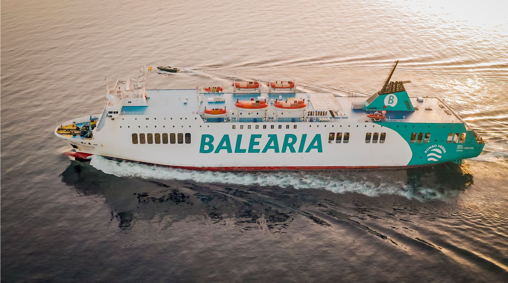

# ETL - Transito Balear de buques de pasaje

En este repositorio se encuentra el proceso de ETL completo para crear una base de datos del transito de buques de pasaje en el mar mediterráneo. 

Se puede seguir el proceso llevado a cabo por el autor en la siguiente [carpeta](https://github.com/Jacobomb/ETL_Project_BalearicTransit/tree/main/notebooks). Aquí se encuentran los notebooks con el código comentado para facilitar la comprensión del lector.

A continuación se comentan los pasos más importantes del trabajo, así como las herramientas y software utilizado. Finalmente se comentarán también trabajos futuros sobre los que el proyecto puede desarrollarse.

## Web Scraping

En este apartado se ha llevado a cabo lo que comunmente se conoce por el anglicismo *web scraping*, o raspado web en castellano.

Se trata de una técnica utilizada en este caso mediante aplicación del entorno [Selenium](https://www.selenium.dev/). Con ayuda de esta herramienta se simula la navegación de un humano en la web de interés incrustando un navegador en una aplicación.

Para este proyecto se ha aplicado la técnica a la web del [Ministerio de Transportes, Moviliad y Agenda Urbana](https://www.mitma.gob.es/) del Gobierno de España.

En esta [web](https://www.portsdebalears.com/es/buques-en-puerto) el autor ha automatizado la búsqueda de la previsión de tráfico marino de buques de pasaje para el rango de fechas comprendido entre el 1 de junio de 2023 y el 31 de agosto del mismo año. Se pretende llevar a cabo un estudio de la movilidad marítima en aguas españolas durante el verano.

Una vez el raspado ha terminado el autor consigue una tabla con 1500 filas, para cada una de ellas se tiene la siguiente información:
* *Barco*: nombre de la embarcación
* *Origen*: puerto de origen	
* *Destino*: puerto de destino
* *Llegada*: fecha de llegada al puerto de destino
* *Salida*: fecha de llegada del puerto de destino
* *Alineacion*: ubicación en el puerto de destino (ver imagen 1)
* *Consignatorio*: representante de la naviera en el puerto de destino
* *GT*: Gross Tonnage - medida de capacidad del barco que cuantifica el volumen de todos los espacios interiores del buque (camarotes, alojamientos, etc.)
* *Escala*: asignación de atraque para un buque en un determinado puerto	
* *Bandera*: indica la nacionalidad de un barco, también conocida como pabellón
* *Eslora*: longitud de un buque desde la proa a la popa
* *Calado*: profundidad que alcanza en el agua la parte sumergida del buque.

Se anima al lector a repasar el código encontrado en el fichero [1.TransitScrapper.ipynb](https://github.com/Jacobomb/ETL_Project_BalearicTransit/blob/main/notebooks/1.TransitScrapper.ipynb) de la carpeta [notebooks](https://github.com/Jacobomb/ETL_Project_BalearicTransit/tree/main/notebooks).

## Weather API

En este apartado se hecho uso de una API  para enriquecer la base de datos. Dado que en el primer paso se consiguió obtener una tabla donde se incluía la fecha de llegada y partida del buque a puerto, se decide hacer uso de la API [*Open-Meteo*](https://open-meteo.com/en/docs) para hallar el clima dado en la fecha de llegada del barco.

Entre la oferta de la API se incluían numerosas variables, pero se tomaron la suma total del precipitación (*daily_rain_sum*) y el viento máximo medido en la jornada (*daily_wind_speed_10m_max*) como variables más importantes de estudio.

Dado que no se podía pedir la altura de las olas ni el estado de la mar a la API, se decide trabajar con el viento máximo por estar directamente relacionado con la bravura del mar.

Para llevar a cabo la llamada a la API se necesitaba proporcionar las coordenadas (*latitud* y *longitud*) del puerto donde se encontraba el puerto para así conseguir el clima más preciso posible. 

Para conseguir las coordenadas de cada puerto se creó una lista de los valores únicos de los puertos de destino y se hizo uso del bot conversacional de inteligencia artificial Bard, ya que al estar conectado a internet puede proporcionar este tipo de datos con gran rapidez y ahorrar una cantidad de tiempo razonable al usuario.

Ya que la API necesitaba como argumentos de entrada las fechas en formato YYYY-MM-DD, se decidió separar las columnas *llegada* y *salida* en *llegada_fecha* y *llegada_hora* e idénticamente con *salida_fecha* y *salida_hora*.

Se puede encontrar el código en la [carpeta](https://github.com/Jacobomb/ETL_Project_BalearicTransit/tree/main/notebooks) en el fichero [2.Weather_API](https://github.com/Jacobomb/ETL_Project_BalearicTransit/blob/main/notebooks/2.Weather_API.ipynb).

## Obtención BBDD adicional del OTLE

En este paso del proyecto se ha llevado a cabo una descarga de una base de datos adicional del *Observatorio del Transporte y la Logística en España* obtenido en la siguiente [página web](https://apps.fomento.gob.es/BDOTLE/visorBDpop.aspx?i=328).

Aquí se incluyen exclusivamente los datos del tráfico comercial de los puertos del Sistema Portuario de Titularidad Estatal. Los datos de número de buques se refieren a los buques mercantes entrados en los puertos de cada una de las Autoridades Portuarias, cualquiera que sea el tipo de navegación (cabotaje o exterior), la nacionalidad (español o extranjero) o el tipo de barco (tanqueros, graneleros, carga general, portacontenedores, etc.).

Los datos de GT se evalúan por las Autoridades Portuarias a partir de los buques mercantes entrados en los puertos y el GT de cada buque.

**GT** es una medida de capacidad del barco que cuantifica el volumen de todos los espacios interiores del buque, incluso camarotes, alojamientos, etc. Figura en el Certificado Internacional de Arqueo de Buques (Convenio Internacional de Londres de 1969). Viene del inglés *Gross Tonnage*, traducible por arqueo bruto.

Una vez se descargan los datos en formato CSV para los últimos tres años disponibles (2018-2019-2021) se pasa a limpiar la base de datos borrando aquellas filas en las que haya registros vacíos. Se borran también gran cantidad de columnas que no aportan al estudio y que pueden ser calculadas con facilidad más adelante.

Se puede encontrar el código en la [carpeta](https://github.com/Jacobomb/ETL_Project_BalearicTransit/tree/main/notebooks) en el fichero [3.OTLE_csv](https://github.com/Jacobomb/ETL_Project_BalearicTransit/blob/main/notebooks/3.OTLE_csv.ipynb).

## Construcción BBDD en MySQL

Una vez llegados a este punto del proyecto, con todas las tablas de datos limpias y guardadas en el equipo del autor, se procede a formar la base de datos en MySQL.

Si se comprueba el fichero [4.sql_builder](https://github.com/Jacobomb/ETL_Project_BalearicTransit/blob/main/notebooks/4.sql_builder.ipynb) se puede ver que se ha hecho uso de python y *mysql.connector* para crear y cargar la base de datos con los ficheros CSV.

## Trabajos futuros

Dado el tamaño de la industria en cuestión, quedan abiertas vías de investigación y trabajo. Uno de los objetivos del proyecto es ser capaz de predecir y automatizar la gestión de puertos para grandes buques. También interesa saber como afecta el clima y la estacionalidad al atraque de grandes buques de pasaje en un país tan dependiente del turismo como es España.

## Herramientas y fuentes utilizadas

* [Pandas](https://pandas.pydata.org/docs/)
* [Selenium](https://www.selenium.dev/)
* [Ministerio de Transportes, Moviliad y Agenda Urbana](https://www.mitma.gob.es/)
* [Open-Meteo](https://open-meteo.com/en/docs)
* [OTLE](https://observatoriotransporte.mitma.es/)
* [SQLAlchemy](https://www.sqlalchemy.org/)

